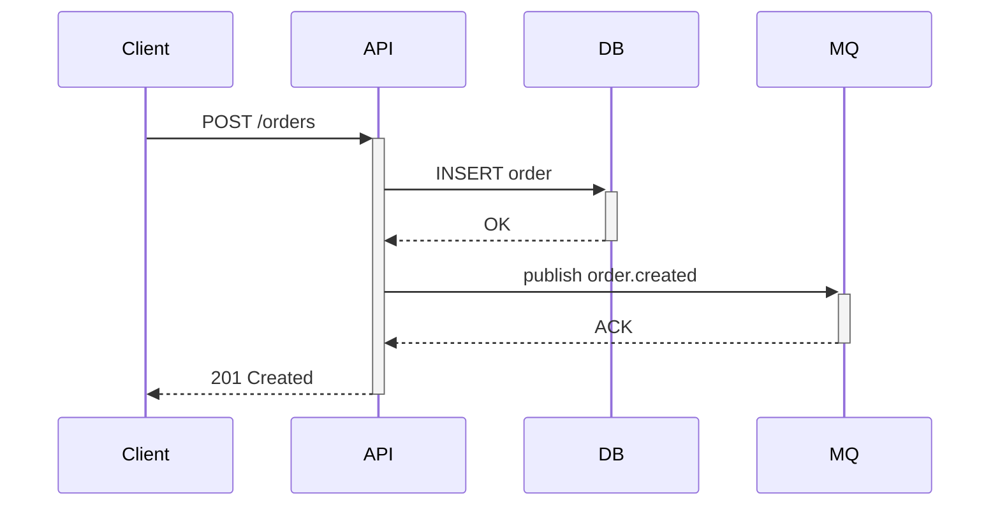

# 如何写好技术文档

> 本文面向需要撰写技术文档（设计文档、操作手册、API 文档、故障报告等）的开发者。
> 全文按照 **Why → How → What → DIY** 的认知递进结构组织。


# 1 Why — 为什么技术文档值得投入

## 1.1 文档是团队的"异步沟通协议"

口头传递知识有三个固有缺陷：
1. **衰减**：信息在传递链中逐级失真（A 告诉 B，B 告诉 C，C 拿到的可能是错的）。
2. **不可检索**：三个月后没人记得当初为什么选了方案 B。
3. **不可扩展**：新人入职只能靠"找人问"，人走了知识就断了。

文档把知识从"个人记忆"变成"组织资产"。一篇好文档的价值 = 节省的沟通次数 × 每次沟通成本。

## 1.2 坏文档比没文档更危险

没文档，团队知道自己不知道，会去问、去查。
坏文档让人以为自己知道了，然后按过期信息操作 → 故障。

常见的"坏文档"特征：
- 命令不可执行（路径变了、参数废弃了）
- 缺少前置条件（读者照做，在第 3 步卡住）
- 没有验证步骤（做完不知道对不对）
- 没有 owner（出了问题找不到人）

## 1.3 好文档的标准：读者能独立完成任务

一篇好的技术文档，检验标准只有一个：

> **目标读者在不问任何人的情况下，能否仅凭此文档完成目标任务并验证结果？**

如果不能，文档就是不合格的。


# 2 How — 写好技术文档的方法论

## 2.1 了解读者：一切的起点

文档不是写给自己的，是写给读者的。在动笔之前，回答三个问题：

| 问题 | 示例 |
| --- | --- |
| **读者是谁？** | 新人 / 资深开发 / 运维 / 非技术人员 |
| **读者要做什么？** | 理解概念 / 完成操作 / 查阅参数 |
| **读者已知什么？** | 认知起点决定了你需要解释多少背景 |

### 2.1.1 抹平信息差

作者和读者之间的认知差异是文档失败的首要原因。常见信息差来源：

**专业术语**
- "CPU 负载过高"、"缓存雪崩"、"算法时间复杂度" — 对非专业读者需要解释。
- 原则：同一概念只用一个术语，首次出现时给出定义或链接。

**相似概念**
- 产品提供了两个相似功能（如 `Query` vs `QueryRow`），文档需要帮读者辨析差异，方便选择。

**新事物**
- 所有首次出现的概念、工具、配置项都需要交代来源和上下文。

### 2.1.2 主动走进读者

写完后不要自我感觉良好，用这些方式验证：
- **同事评审**：让一个不了解背景的同事照着文档操作一遍。
- **读者访谈**：了解读者对文档的期待和痛点。
- **支持群反馈**：建立文档支持渠道，收集"按文档做但失败了"的案例 — 这是最有价值的改进素材。

时常问自己：
- **读者从哪里来？** 他们遇到了什么问题？手边有哪些资源？
- **读者在哪？** 他们当前处于什么状态？如何确认自己处于文档描述的状态？
- **读者到哪里去？** 看完这段之后，下一步该做什么？

### 2.1.3 案例：信息差导致的文档问题

原文：
> Error: 视频数据包不完整，主要发生在上下麦瞬间，packet不完整会引起花屏。

| 问题点 | 分析 | 问题类型 |
| --- | --- | --- |
| "主要发生" | 缺少主语，增加理解负担 | 写作问题 |
| "上下麦" | 谁在上下麦？ | 缺乏对新事物的解释 |
| "packet" | 与前文"数据包"重复，中英夹杂 | 术语不统一 |
| "引起花屏" | 哪里出现花屏？ | 缺乏对新事物的解释 |

改造后：
> Error: 视频数据包不完整，**该错误**主要发生在**主播端**上下麦的瞬间。**数据包**不完整会造成**接收端**出现花屏。

### 2.1.4 面向混合受众的分层策略

现实中，读者群体往往不单一。例如一篇设计文档的读者同时包括：
- **技术 Leader**：关心取舍理由、风险、时间线
- **开发者**：关心接口定义、数据结构、实现细节
- **QA / 运维**：关心可测试性、部署变更、回滚影响

用单一深度写作，要么 Leader 觉得太细，要么开发者觉得太浅。

**推荐：漏斗式分层结构**

```
┌─────────────────────────────────┐
│  Executive Summary (1段)         │  ← 所有人都读
│  核心结论 + 关键取舍 + 风险       │
├─────────────────────────────────┤
│  方案概述 (1-2页)                │  ← Leader + 核心开发者
│  架构图 + 方案对比 + 里程碑       │
├─────────────────────────────────┤
│  技术详情 (按需展开)              │  ← 实现者
│  接口定义 + 数据模型 + 边界       │
├─────────────────────────────────┤
│  附录                            │  ← 速查
│  配置项 + 错误码 + 变更记录       │
└─────────────────────────────────┘
```

原则：**每一层都能独立阅读**，不需要读完全文才能理解该层的核心信息。

## 2.2 结构化写作：让信息有序流动

### 2.2.1 为什么要结构化？

- **对作者**：理清思路，找到写作方向和重点，避免遗漏。
- **对读者**：快速锁定目标信息，获取核心观点，降低阅读成本。

### 2.2.2 结构化三步法

**第一步：搭建框架**

纵向维度：
- **结论先行**：把核心观点放在开头，让读者一目了然。
- **以上统下**：上层是概括，下层是支撑证据和细节。

横向维度：
- **归类分组**：相关信息按标准分类，归入同一逻辑范畴。
- **逻辑递进**：按因果、时序、重要性等逻辑排列。

**第二步：填充必要信息**

每个章节问自己：读者看到这里，还缺什么信息才能继续？把"读者需要知道的"而非"作者想写的"作为内容取舍标准。

**第三步：结构化呈现**

| 呈现方式 | 适用场景 |
| --- | --- |
| 无序列表 | 并列关系，无先后之分 |
| 有序列表 | 步骤、优先级、时间顺序 |
| 表格 | 对比、参数、多维度信息 |
| 代码块 | 命令、配置、代码示例 |
| 流程图 | 决策路径、状态转换 |

### 2.2.3 案例：结构化改造

**改造前**（大段文字，信息混杂）：

> 内容上线应用商店，无论使用消费者设备还是企业设备都需要先签订协议。请勾选应用发布的设备型号。C端开发者在创建应用时，建议勾选系列设备下的全部型号；企业开发者在创建应用时，请选择对应企业设备版本(目前在售的企业版本设备包括Neo3 Pro、Neo 3 Eye、G2 4KS)。通过测试后，应用方可上线。

**改造后**（结构清晰，信息分层）：

> 本文介绍了应用上线某应用商店的必要条件、潜在卡点以及对接人。
>
> **必要条件**
> 1. 选择设备型号：个人应用建议全选；企业应用选择企业版（Neo3 Pro、Neo 3 Eye、G2 4KS）。
> 2. 签署上线协议：所有应用均需签署。
> 3. 通过上线测试：测试成功后即可上线。
>
> **潜在卡点**
>
> | 卡点 | 联系人 |
> | --- | --- |
> | 开发者账号注册未通过 / 审核未反馈 | 商务对接人 |
> | 应用未通过测试 / 通过后未上线 | 运营对接人 |

### 2.2.4 善用视觉表达

文字擅长解释"为什么"，图表擅长展示"是什么结构"和"怎么流动"。

| 场景 | 优先用图 | 优先用文字 |
| --- | --- | --- |
| 3+ 组件的交互关系 | ✓ | |
| 状态转换与分支逻辑 | ✓ | |
| 时序交互（A 调 B，B 回 A） | ✓ | |
| 因果推理与论证 | | ✓ |
| 单一线性步骤 | | ✓ |

**Markdown 友好的绘图方式**

在 Git 仓库中，推荐使用文本化绘图工具（可 diff、可 review）：

| 工具 | 特点 | 适用场景 |
| --- | --- | --- |
| Mermaid | 嵌入 Markdown，GitHub/GitLab 原生渲染 | 流程图、时序图、类图 |
| PlantUML | 语法丰富，需渲染插件 | 复杂时序图、组件图 |
| ASCII 图 | 最轻量，无需任何工具 | 内联架构示意 |

示例 — Mermaid 时序图：



**图表规范**
- 每张图有标题，说明"这张图展示什么"
- 关键元素需要图例或标注
- 图中的版本/组件名与正文保持一致
- 二进制图片（PNG/SVG）放在 `images/` 子目录，Markdown 中引用相对路径

## 2.3 写好标题：SPA 原则

标题是读者的第一印象，也是搜索命中的关键。

**SPA 原则**：
- **S**imple — 简明扼要，不超过 20 字
- **P**rofit — 与读者利益相关（读者能从中得到什么？）
- **A**ccurate — 准确客观，不夸大不模糊

不同文档类型的标题范式：

| 类型 | 标题模式 | 示例 |
| --- | --- | --- |
| 概念型 | 名词 + 名词 | 《连接池原理》《MVCC 概述》 |
| 任务型 | 动词 + 名词 | 《部署 Redis 集群》《配置 CI/CD 流水线》 |
| 参考型 | 名词 + 名词 | 《API 参数说明》《错误码一览》 |

## 2.4 极简写作：用最少的字传递最多的信息

### 2.4.1 核心原则

- 用最精炼的语言概括最有价值的信息。
- 每删掉一个多余的字，读者的认知负担就减少一分。

### 2.4.2 三个实践

**保持前后一致**
- 同一概念只用一个术语（不要交替使用"集群"和"cluster"）。
- 同一类操作使用相同的句式结构。
- 同一层级标题使用相同的语法模式。

**消除啰嗦**
- 口语化 → 书面化：删除"其实"、"然后呢"、"就是说"等口语填充词。
- 叙事反复 → 一次说清：如果一个观点在两处重复，合并到一处。

| 啰嗦 | 精简 |
| --- | --- |
| 我们需要做的是先去检查一下配置文件 | 检查配置文件 |
| 在这种情况下我们可以考虑使用 Redis | 此场景适合使用 Redis |
| 关于这个问题我们的建议是重启服务 | 建议：重启服务 |

**提供路标和索引**
- 章节开头用一句话概括本节内容。
- 长文档提供目录（TOC）。
- 交叉引用相关章节（"详见第 5 节"）。
- 对外链接标注目标内容的关键信息，避免"点击这里"。

## 2.5 代码示例：文档中最重要的"证据"

对开发者而言，代码示例往往是文档中最先被阅读的部分。一个好的代码示例胜过三段文字解释。

### 2.5.1 可运行 vs 片段：何时用哪种

| 类型 | 特点 | 适用场景 |
| --- | --- | --- |
| 可运行示例 | 复制即跑，包含 import 和 main | 快速入门、API 首次使用、操作手册 |
| 关键片段 | 只展示核心逻辑，省略样板代码 | 原理讲解、方案对比、性能分析 |

原则：**任务型文档中的命令和代码必须可直接复制执行**。概念型文档中的片段需标注"此为简化示例"。

### 2.5.2 代码示例的质量标准

1. **自包含**：读者不需要猜测省略的 import、变量定义或上下文。
2. **注释说明意图**：解释"为什么这样做"，而非复述代码逻辑。
3. **展示输出**：紧跟代码块给出预期输出，让读者能验证。
4. **覆盖失败路径**：不只展示 happy path，同时展示错误处理。

**好的示例 — 自包含、有输出、有错误处理：**

```go
package main

import (
    "fmt"
    "io"
    "log"
    "net/http"
)

func main() {
    resp, err := http.Get("https://api.example.com/users/1")
    if err != nil {
        log.Fatalf("请求失败: %v", err)
    }
    defer resp.Body.Close()

    if resp.StatusCode != http.StatusOK {
        log.Fatalf("非预期状态码: %d", resp.StatusCode)
    }

    body, err := io.ReadAll(resp.Body)
    if err != nil {
        log.Fatalf("读取响应失败: %v", err)
    }
    fmt.Println(string(body))
}
// 预期输出: {"id":1,"name":"alice","email":"alice@example.com"}
```

### 2.5.3 保持代码示例与实际代码同步

代码示例过期是技术文档腐化的头号原因。防腐策略：

- **CI 验证**：将关键示例提取为可编译的 `_example_test.go`，纳入 `go test` 流水线。
- **版本锚定**：示例中涉及的依赖版本与 `go.mod` 保持一致，升级时同步更新。
- **变更联动**：在 PR 模板中加入检查项 — "本次变更是否影响文档中的代码示例？"

## 2.6 写作后检查：以批判者视角审视

写完不是终点。建议写完后冷却一段时间（至少几小时），再以"批判者"视角自查：

| 维度 | 自查问题 |
| --- | --- |
| 主题 | 是否明确聚焦？内容是否跑题？ |
| 结构 | 是否遵循逻辑顺序？是否结论先行？ |
| 标题 | 是否符合 SPA 原则？ |
| 内容 | 表述是否简洁？命令是否可执行？ |
| 完整性 | 前置条件、步骤、验证、回滚是否齐全？ |


# 3 What — 文档类型与结构模板

不同类型的文档有不同的结构范式。搞清楚"这篇文档属于哪种类型"是动笔前最重要的决策。

## 3.1 概念型文档

适合回答 **"是什么、为什么、何时用"**。

建议结构：
1. 定义（一句话）
2. 背景与问题（为什么需要这个东西）
3. 核心原理（配图可选）
4. 适用场景与不适用场景
5. 方案对比（优缺点、成本、风险）
6. 最小示例（可运行或可推演）
7. 常见误区
8. 延伸阅读

## 3.2 任务型文档

适合回答 **"怎么做、怎么验证、失败怎么办"**。

建议结构：
1. 目标与完成标准
2. 前置条件（权限、环境、依赖）
3. 分步骤操作（每步附命令与预期输出）
4. 验证方法
5. 回滚方案
6. 故障排查
7. 安全注意事项

> **最小要求**：任何任务型文档都应至少包含"前置条件、步骤、预期输出、验证、回滚"5 项。

## 3.3 参考型文档

适合 **参数、API、配置项、错误码速查**。

建议结构：
1. 数据字典 / 参数表（字段、类型、默认值、是否必填、说明）
2. 示例请求与示例响应
3. 错误码（含触发条件与处理建议）
4. 兼容性说明（版本差异）
5. 变更历史（新增、废弃、替换）

## 3.4 故障排查文档

适合 **从"描述现象"到"可修复"的完整链路**。

建议结构（固定 7 段）：
1. **现象**：用户看到什么，系统报什么
2. **影响**：影响范围、优先级、是否阻断主流程
3. **环境**：发生环境、版本、时间窗口、变更背景
4. **根因**：证据链（日志、指标、trace、SQL）
5. **处理步骤**：按顺序可执行，每步有预期输出
6. **验证**：修复后如何确认恢复
7. **预防**：如何避免再次发生（监控、阈值、流程改进）

### 写作禁忌
- 只写"可能是网络问题"而不给证据
- 只写"重启试试"而不说明风险与回滚
- 只写"已恢复"而没有验证标准
- 只写结论不写适用条件，导致后续误用

## 3.5 设计文档（RFC / ADR）

适合回答 **"为什么选这个方案、拒绝了哪些备选、有什么风险"**。设计文档是工程团队最高频的决策载体，也是事后复盘和新人理解系统演进的核心材料。

建议结构：
1. **元信息**：标题、作者、状态（Draft → In Review → Accepted / Rejected → Superseded）、日期
2. **背景与问题**：当前痛点是什么，为什么现在要解决
3. **目标与非目标**：明确边界 — 这次做什么、不做什么
4. **方案对比**（至少两个备选）：

| 维度 | 方案 A | 方案 B | 方案 C |
| --- | --- | --- | --- |
| 核心思路 | | | |
| 实现复杂度 | | | |
| 性能影响 | | | |
| 运维成本 | | | |
| 风险 | | | |
| 时间线 | | | |

5. **决策结论**：选了哪个，为什么（取舍理由比结论本身更重要）
6. **详细设计**：接口定义、数据模型、关键流程图
7. **风险与缓解**：已知风险 + 对应预案
8. **里程碑与验收标准**：可衡量的交付节点
9. **开放问题**：尚未决定的事项，标注决策截止日期

> **ADR（Architecture Decision Record）** 是设计文档的轻量变体，专注于记录单个架构决策。格式更短：标题 → 背景 → 决策 → 后果。适合不需要完整 RFC 流程的小型决策。

### 写作要点
- **方案对比是灵魂**：只写"我们选了 X"没有价值；写清"为什么不选 Y 和 Z"才是决策文档的核心。
- **非目标同样重要**：明确"不做什么"能防止 scope creep，也让 reviewer 知道哪些问题不需要在此文档中解决。
- **状态必须维护**：方案被废弃时，标记 `Superseded by: <链接>`，避免后人误用旧方案。

## 3.6 选型决策

| 读者目的 | 优先文档类型 |
| --- | --- |
| 理解一个概念 | 概念型 |
| 完成一个操作 | 任务型 |
| 查一个参数 | 参考型 |
| 排一个故障 | 故障排查型 |
| 记录一个决策 | 设计文档（RFC/ADR） |

原则：一篇文档只做一件主事。混合过多时应拆分并交叉链接。


# 4 DIY — 可直接复用的模板与工具

## 4.1 一页式任务文档模板

适用于大多数"要让别人做成一件事"的技术文档。建议新文档默认从此模板创建。

````markdown
# <文档标题：动词+对象，例如《部署 XXX 服务》>

## 1. 目标与范围
- 目标读者：<开发/测试/运维/值班同学>
- 解决问题：<一句话说明这篇文档解决什么问题>
- 适用范围：<系统/版本/环境>
- 不适用范围：<明确边界，避免误用>

## 2. 前置条件
- 权限要求：<账号权限、角色>
- 环境要求：<OS、Go/MySQL/Redis 版本>
- 依赖准备：<配置、密钥、网络、工具>
- 输入材料：<需要提前准备的文件/参数>

## 3. 操作步骤
### 3.1 步骤一：<名称>
- 目的：<为什么做这一步>
- 命令：
```bash
<可复制命令>
```
- 预期输出（成功判定）：
```text
<关键输出或状态>
```
- 常见失败与处理：<失败现象 + 对应动作>

### 3.2 步骤二：<名称>
...（同上）

## 4. 验证与回滚
- 验证命令：
```bash
<验证命令>
```
- 验证通过标准：<可量化标准>
- 回滚条件：<什么情况下必须回滚>
- 回滚步骤：
```bash
<回滚命令>
```

## 5. 故障排查（FAQ）
- Q1：<现象>
  - 原因：
  - 处理：

## 6. 元信息
- Owner：<负责人>
- Reviewer：<评审人>
- 创建时间：<YYYY-MM-DD>
- 最近更新时间：<YYYY-MM-DD>
- 变更记录：<链接或列表>
````

## 4.2 故障排查模板

````markdown
### 故障：<标题>
- 现象：<具体报错/异常表现>
- 影响：<影响用户、影响范围、紧急程度>
- 环境：<prod/staging + 版本 + 时间>
- 根因：<证据1/证据2/证据3>

#### 处理步骤
1. <步骤1>
   - 命令：
   - 预期输出：
2. <步骤2>
   - 命令：
   - 预期输出：

#### 验证
- 验证命令：
- 验证标准：

#### 预防
- 监控项：
- 告警阈值：
- 流程改进：
````

## 4.3 设计文档模板

````markdown
# <RFC/ADR 编号>：<标题>

## 元信息
- 作者：<姓名>
- 状态：Draft / In Review / Accepted / Superseded
- 创建日期：<YYYY-MM-DD>
- 决策截止日期：<YYYY-MM-DD>

## 1. 背景与问题
<当前痛点是什么，为什么现在要解决>

## 2. 目标与非目标
**目标**
- <目标1>
- <目标2>

**非目标（明确不做）**
- <非目标1>
- <非目标2>

## 3. 方案对比

| 维度 | 方案 A：<名称> | 方案 B：<名称> |
| --- | --- | --- |
| 核心思路 | | |
| 实现复杂度 | | |
| 性能影响 | | |
| 运维成本 | | |
| 风险 | | |

## 4. 决策
选择方案 <X>。

**选择理由**：

**为什么不选方案 <Y>**：

## 5. 详细设计
### 5.1 接口定义
### 5.2 数据模型
### 5.3 关键流程

## 6. 风险与缓解

| 风险 | 概率 | 影响 | 缓解措施 |
| --- | --- | --- | --- |
| | | | |

## 7. 里程碑

| 节点 | 日期 | 验收标准 |
| --- | --- | --- |
| | | |

## 8. 开放问题

| 问题 | 负责人 | 截止日期 |
| --- | --- | --- |
| | | |
````

## 4.4 质量门禁 Checklist

发布前按下表逐项自检，评审时也使用同一张表：

| 维度 | 门禁项 | 通过标准 |
| --- | --- | --- |
| 可执行性 | 所有命令可复制执行 | 抽样或全量执行通过率 = 100% |
| 可验证性 | 每个关键步骤有"预期输出" | 关键步骤覆盖率 = 100% |
| 完整性 | 包含前置条件、步骤、预期输出、验证、回滚 | 5 项必须全部存在 |
| 一致性 | 术语、命名、单位前后一致 | 同义词混用 = 0 |
| 准确性 | 版本/参数/路径已核对 | 关键事实抽检无误 |
| 可维护性 | 有 Owner 与最近更新时间 | 元信息字段完整 |
| 可检索性 | 标题与小节可搜索 | 标题能准确命中关键字 |
| 可读性 | 单段不过长、列表化表达 | 80%+ 信息可在列表/表格定位 |
| 代码示例 | 代码块可复制执行或标注"片段" | 关键命令/示例抽样执行通过 |
| 视觉表达 | 图表有标题、图例，与正文术语一致 | 每张图有标题说明 |

发布规则建议：
1. **任务型文档**：以上门禁必须全通过。
2. **概念型/参考型文档**：除"回滚"外，其余门禁必须通过。
3. **未通过门禁的文档**标记为 `draft`，禁止作为正式操作依据。

## 4.5 文档元信息规范

每篇文档顶部建议维护以下字段：

| 字段 | 说明 | 示例 |
| --- | --- | --- |
| title | 文档标题 | 如何写好技术文档 |
| owner | 直接负责人 | john.q |
| reviewers | 评审人 | team-doc |
| status | 文档状态 | draft / active / deprecated |
| last_updated | 最近更新日期 | 2026-02-25 |
| applicable_versions | 适用版本范围 | Go 1.24+, MySQL 8.0 |

## 4.6 文档维护机制（防过期）

### 更新触发条件

出现以下任一情况，文档必须在同一迭代内更新：
1. 命令、配置项、接口参数发生变更。
2. 默认行为因版本升级发生变化。
3. 故障处理流程或值班路径变化。
4. 出现"按文档执行仍失败"的案例。

### 周期性复查

| 文档频率 | 复查周期 | 示例 |
| --- | --- | --- |
| 高频（发布、部署、故障处理） | 每月 | 发布操作手册 |
| 中频（日常开发流程） | 每季度 | 开发环境搭建指南 |
| 低频（背景知识） | 每半年 | 架构设计文档 |

复查结果标记：
- `active`：已确认可用
- `needs-update`：内容部分过期，限期修订
- `deprecated`：不再适用，给出替代文档链接

### 版本兼容矩阵

关键文档建议增加兼容矩阵，减少"版本误用"：

| 组件 | 版本 | 状态 | 备注 |
| --- | --- | --- | --- |
| Go | 1.24.x | 支持 | 当前验证版本 |
| MySQL | 8.0.x | 支持 | 参数语义已校验 |
| Redis | 7.x | 支持 | 命令示例基于该版本 |
| MySQL | 5.7.x | 限制支持 | 需参考旧版文档 |


## 4.7 Docs-as-Code 工程化实践

将文档视为代码资产，纳入工程流水线管理。

### 文档 CI 检查项

| 检查项 | 工具 | 说明 |
| --- | --- | --- |
| Markdown 格式 | markdownlint | 标题层级、列表缩进、空行规范 |
| 拼写检查 | cspell / aspell | 中英文混排下的拼写错误 |
| 链接有效性 | markdown-link-check | 检测死链和 404 |
| 代码块可编译 | `go vet` / `go build` | 确保文档中的 Go 代码示例可编译 |
| 术语一致性 | Vale（自定义规则） | 检测同义词混用（如"集群" vs "cluster"） |

### 文档 Review 与代码 Review 的差异

| 维度 | 代码 Review | 文档 Review |
| --- | --- | --- |
| 首要关注 | 正确性、性能、安全 | 可理解性、可执行性、完整性 |
| 评审视角 | "实现是否正确" | "读者能否独立完成任务" |
| 常见盲区 | 边界条件 | 前置条件缺失、术语未解释 |
| 验证方式 | 跑测试 | 让不了解背景的人照做一遍 |

### PR 模板中的文档检查项

在团队 PR 模板中加入文档影响评估：

```markdown
### 文档影响
- [ ] 本次变更不影响现有文档
- [ ] 已更新相关文档（链接：___）
- [ ] 文档中的代码示例已验证可运行
- [ ] 新增接口/配置项已补充到参考文档
```

### 从代码自动生成文档

| 来源 | 工具 | 输出 |
| --- | --- | --- |
| Go 包注释 | `godoc` / `pkgsite` | API 文档 |
| OpenAPI 注解 | swag / oapi-codegen | REST API 文档 |
| Proto 文件 | protoc-gen-doc | gRPC 接口文档 |
| 数据库 DDL | tbls / schemaspy | 数据字典 |

原则：**能从代码生成的文档不要手写**。手写的文档一定会与代码脱节；自动生成的文档至少与构建版本一致。


# 5 附录：技术文档写作的认知模型

## 5.1 Why → How → What → DIY

本文自身就遵循这一结构：

```
Why   (第1章)  → 为什么要写好文档？动机和代价
How   (第2章)  → 怎么写好？方法论和原则
What  (第3章)  → 写什么？不同类型的结构范式
DIY   (第4章)  → 拿来就用的模板和工具
```

这个结构符合人的认知递进规律：
- 先建立动机（否则读者没有动力往下看）
- 再掌握方法（知道"怎么做"的框架）
- 然后了解具体类型（针对性地"做什么"）
- 最后给出可操作的工具（降低行动门槛）

## 5.2 文档写作的 80/20 法则

如果只记住一件事：**让读者能独立完成任务**。

如果能记住五件事：
1. 知道读者是谁
2. 结论先行
3. 每个步骤有预期输出
4. 有验证和回滚
5. 有 owner 和更新日期
